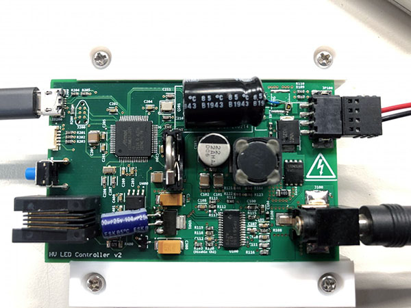

# pcb-ba-acroiq-hv
AcroIQ High Voltage LED Driver PCB project

This is a high voltage LED driver designed to power 1-2 strings of 100-150mA
LEDs at up to 120V output, with a 12V input. On board control, including an RTC,
a CANbus port, as well as a USB port is provided.

The PCB is designed to fit in a Hammond Mfg 1455C801 enclosure
(https://www.hammfg.com/electronics/small-case/extruded/1455).

Power supply is 12V 2A for a single string.

Firmware is located at https://github.com/blueacro/ba-firmware-driver-hv 
